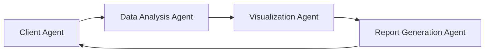
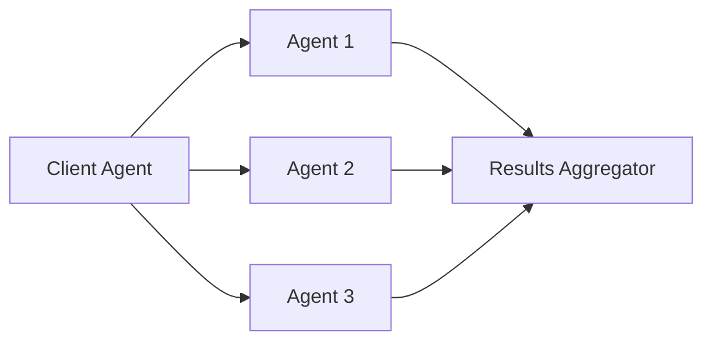
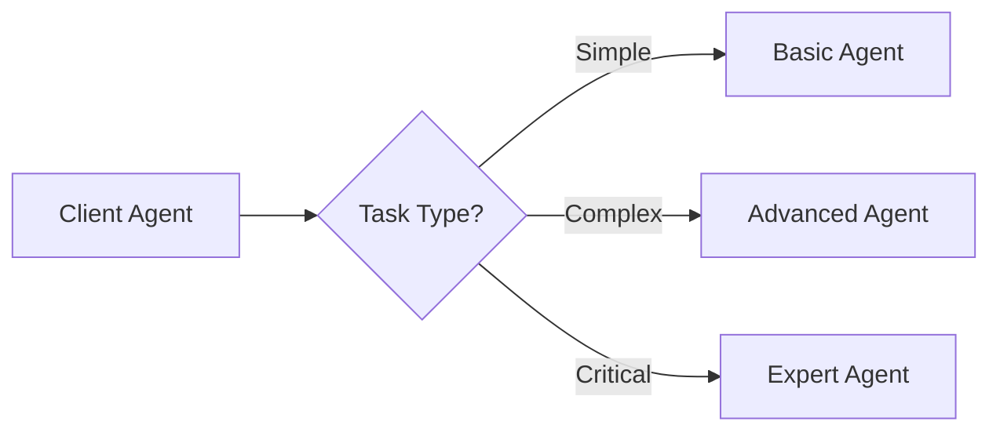

# Agent Development Guide

This guide provides comprehensive information for developing A2A-compatible agents, including sample implementations, best practices, and integration patterns.

## 📋 Featured Agent Examples

### 1. Data Analysis Agent

**Provider:** OpenAI  
**Categories:** Data Analysis, Research  
**Skills:** Data processing, Statistical analysis, Visualization

**Description:**  
A specialized agent for data analysis tasks, capable of processing large datasets, performing statistical analysis, and generating visualizations. This agent demonstrates how A2A can be used for complex data workflows.

**Key Features:**
- CSV/JSON data processing
- Statistical analysis and modeling
- Chart and graph generation
- Report generation
- Integration with popular data sources

**A2A Integration Example:**
```json
{
  "agent_id": "data-analysis-agent",
  "capabilities": {
    "data_processing": {
      "supported_formats": ["csv", "json", "excel"],
      "max_file_size": "100MB"
    },
    "analysis": {
      "statistical_tests": ["t-test", "anova", "correlation"],
      "visualization_types": ["bar", "line", "scatter", "heatmap"]
    }
  }
}
```

**Implementation:**
```python
from a2a import Agent, Task, Response
import pandas as pd
import numpy as np
import matplotlib.pyplot as plt
import seaborn as sns

class DataAnalysisAgent(Agent):
    def __init__(self):
        self.supported_formats = ['csv', 'json', 'excel']
        self.max_file_size = 100 * 1024 * 1024  # 100MB
        
    async def process_task(self, task: Task) -> Response:
        try:
            if task.type == 'analyze_dataset':
                return await self.analyze_dataset(task.data, task.options)
            elif task.type == 'generate_visualization':
                return await self.generate_visualization(task.data, task.options)
            elif task.type == 'statistical_test':
                return await self.perform_statistical_test(task.data, task.options)
            else:
                raise ValueError(f"Unsupported task type: {task.type}")
        except Exception as e:
            return Response(content={'error': str(e)}, status="error")
    
    async def analyze_dataset(self, data, options):
        # Load and process data
        df = pd.read_csv(data['file_path'])
        
        # Perform analysis based on options
        analysis_result = {
            'summary_stats': df.describe().to_dict(),
            'missing_values': df.isnull().sum().to_dict(),
            'data_types': df.dtypes.to_dict(),
            'shape': df.shape
        }
        
        return Response(content=analysis_result, status="completed")
    
    async def generate_visualization(self, data, options):
        df = pd.DataFrame(data)
        chart_type = options.get('chart_type', 'bar')
        
        if chart_type == 'bar':
            plt.figure(figsize=(10, 6))
            df.plot(kind='bar')
            plt.title(options.get('title', 'Bar Chart'))
            plt.tight_layout()
            
        # Save and return chart
        chart_path = f"/tmp/chart_{hash(str(data))}.png"
        plt.savefig(chart_path)
        plt.close()
        
        return Response(content={'chart_path': chart_path}, status="completed")
```

### 2. Customer Support Agent

**Provider:** Anthropic  
**Categories:** Customer Service, Communication  
**Skills:** Natural language processing, Ticket management, Escalation

**Description:**  
An intelligent customer support agent that can handle customer inquiries, manage support tickets, and escalate complex issues to human agents when necessary.

**Key Features:**
- Natural language understanding
- Multi-language support
- Ticket categorization and routing
- Knowledge base integration
- Escalation protocols

**Implementation:**
```python
from a2a import Agent, Task, Response
import re
from typing import Dict, List

class CustomerSupportAgent(Agent):
    def __init__(self):
        self.knowledge_base = self.load_knowledge_base()
        self.escalation_threshold = 0.8
        
    async def process_task(self, task: Task) -> Response:
        if task.type == 'handle_inquiry':
            return await self.handle_customer_inquiry(task.data)
        elif task.type == 'categorize_ticket':
            return await self.categorize_ticket(task.data)
        elif task.type == 'escalate_issue':
            return await self.escalate_issue(task.data)
        else:
            raise ValueError(f"Unsupported task type: {task.type}")
    
    async def handle_customer_inquiry(self, inquiry_data):
        customer_message = inquiry_data['message']
        customer_id = inquiry_data['customer_id']
        
        # Analyze message sentiment and complexity
        sentiment_score = self.analyze_sentiment(customer_message)
        complexity_score = self.assess_complexity(customer_message)
        
        # Check if escalation is needed
        if complexity_score > self.escalation_threshold:
            return await self.escalate_issue({
                'customer_id': customer_id,
                'message': customer_message,
                'reason': 'high_complexity'
            })
        
        # Generate response
        response = self.generate_response(customer_message, sentiment_score)
        
        return Response(content={
            'response': response,
            'sentiment': sentiment_score,
            'complexity': complexity_score,
            'escalated': False
        }, status="completed")
    
    def analyze_sentiment(self, message: str) -> float:
        # Simple sentiment analysis (in practice, use a proper NLP library)
        positive_words = ['good', 'great', 'excellent', 'happy', 'satisfied']
        negative_words = ['bad', 'terrible', 'unhappy', 'angry', 'frustrated']
        
        words = message.lower().split()
        positive_count = sum(1 for word in words if word in positive_words)
        negative_count = sum(1 for word in words if word in negative_words)
        
        return (positive_count - negative_count) / len(words) if words else 0
    
    def assess_complexity(self, message: str) -> float:
        # Assess message complexity based on length, technical terms, etc.
        technical_terms = ['api', 'integration', 'configuration', 'deployment']
        words = message.lower().split()
        
        technical_count = sum(1 for word in words if word in technical_terms)
        length_factor = min(len(words) / 50, 1.0)  # Normalize by expected length
        
        return (technical_count * 0.3 + length_factor * 0.7)
```

### 3. Code Review Agent

**Provider:** GitHub  
**Categories:** Development, Code Quality  
**Skills:** Code analysis, Security scanning, Best practices

**Description:**  
An automated code review agent that analyzes code quality, identifies potential issues, and suggests improvements based on best practices and security standards.

**Key Features:**
- Static code analysis
- Security vulnerability detection
- Code style enforcement
- Performance optimization suggestions
- Integration with CI/CD pipelines

**Implementation:**
```python
from a2a import Agent, Task, Response
import ast
import re
from typing import List, Dict

class CodeReviewAgent(Agent):
    def __init__(self):
        self.security_patterns = self.load_security_patterns()
        self.style_guidelines = self.load_style_guidelines()
        
    async def process_task(self, task: Task) -> Response:
        if task.type == 'review_code':
            return await self.review_code(task.data)
        elif task.type == 'security_scan':
            return await self.security_scan(task.data)
        elif task.type == 'style_check':
            return await self.style_check(task.data)
        else:
            raise ValueError(f"Unsupported task type: {task.type}")
    
    async def review_code(self, code_data):
        code = code_data['code']
        language = code_data.get('language', 'python')
        
        review_results = {
            'security_issues': await self.security_scan({'code': code, 'language': language}),
            'style_issues': await self.style_check({'code': code, 'language': language}),
            'performance_suggestions': self.analyze_performance(code, language),
            'best_practices': self.check_best_practices(code, language)
        }
        
        # Calculate overall score
        total_issues = len(review_results['security_issues']) + len(review_results['style_issues'])
        score = max(0, 100 - total_issues * 10)
        
        review_results['score'] = score
        review_results['recommendations'] = self.generate_recommendations(review_results)
        
        return Response(content=review_results, status="completed")
    
    async def security_scan(self, code_data):
        code = code_data['code']
        issues = []
        
        # Check for common security vulnerabilities
        for pattern, description in self.security_patterns.items():
            if re.search(pattern, code, re.IGNORECASE):
                issues.append({
                    'type': 'security',
                    'severity': 'high',
                    'description': description,
                    'line': self.find_line_number(code, pattern)
                })
        
        return issues
    
    async def style_check(self, code_data):
        code = code_data['code']
        issues = []
        
        # Check for style violations
        for guideline, pattern in self.style_guidelines.items():
            if re.search(pattern, code):
                issues.append({
                    'type': 'style',
                    'severity': 'low',
                    'description': f"Style violation: {guideline}",
                    'line': self.find_line_number(code, pattern)
                })
        
        return issues
    
    def analyze_performance(self, code: str, language: str) -> List[str]:
        suggestions = []
        
        # Performance analysis logic
        if 'for loop' in code.lower() and 'list comprehension' not in code.lower():
            suggestions.append("Consider using list comprehension for better performance")
        
        if 'import *' in code:
            suggestions.append("Avoid wildcard imports for better performance and clarity")
        
        return suggestions
    
    def check_best_practices(self, code: str, language: str) -> List[str]:
        practices = []
        
        # Check for best practices
        if 'TODO' in code or 'FIXME' in code:
            practices.append("Remove TODO/FIXME comments before production")
        
        if 'print(' in code:
            practices.append("Use proper logging instead of print statements")
        
        return practices
```

### 4. Financial Analysis Agent

**Provider:** Bloomberg  
**Categories:** Finance, Analytics  
**Skills:** Market analysis, Risk assessment, Portfolio optimization

**Description:**  
A financial analysis agent that provides market insights, risk assessments, and portfolio optimization recommendations based on real-time market data.

**Key Features:**
- Real-time market data analysis
- Risk assessment models
- Portfolio optimization algorithms
- Regulatory compliance checking
- Financial reporting

**Implementation:**
```python
from a2a import Agent, Task, Response
import numpy as np
import pandas as pd
from typing import Dict, List

class FinancialAnalysisAgent(Agent):
    def __init__(self):
        self.risk_models = self.load_risk_models()
        self.market_data_source = self.connect_market_data()
        
    async def process_task(self, task: Task) -> Response:
        if task.type == 'analyze_portfolio':
            return await self.analyze_portfolio(task.data)
        elif task.type == 'risk_assessment':
            return await self.risk_assessment(task.data)
        elif task.type == 'market_analysis':
            return await self.market_analysis(task.data)
        elif task.type == 'optimize_portfolio':
            return await self.optimize_portfolio(task.data)
        else:
            raise ValueError(f"Unsupported task type: {task.type}")
    
    async def analyze_portfolio(self, portfolio_data):
        holdings = portfolio_data['holdings']
        benchmark = portfolio_data.get('benchmark', 'SPY')
        
        # Calculate portfolio metrics
        portfolio_value = sum(holding['value'] for holding in holdings)
        weights = [holding['value'] / portfolio_value for holding in holdings]
        
        # Get historical data
        symbols = [holding['symbol'] for holding in holdings]
        historical_data = await self.get_historical_data(symbols)
        
        # Calculate returns and risk metrics
        returns = self.calculate_returns(historical_data, weights)
        volatility = self.calculate_volatility(returns)
        sharpe_ratio = self.calculate_sharpe_ratio(returns)
        
        analysis_result = {
            'portfolio_value': portfolio_value,
            'total_return': returns['total_return'],
            'annualized_return': returns['annualized_return'],
            'volatility': volatility,
            'sharpe_ratio': sharpe_ratio,
            'diversification_score': self.calculate_diversification(weights),
            'sector_allocation': self.analyze_sector_allocation(holdings)
        }
        
        return Response(content=analysis_result, status="completed")
    
    async def risk_assessment(self, portfolio_data):
        holdings = portfolio_data['holdings']
        
        # Calculate various risk metrics
        var_95 = self.calculate_value_at_risk(holdings, confidence_level=0.95)
        var_99 = self.calculate_value_at_risk(holdings, confidence_level=0.99)
        max_drawdown = self.calculate_max_drawdown(holdings)
        
        # Stress testing
        stress_scenarios = self.run_stress_tests(holdings)
        
        risk_assessment = {
            'value_at_risk_95': var_95,
            'value_at_risk_99': var_99,
            'max_drawdown': max_drawdown,
            'stress_test_results': stress_scenarios,
            'risk_level': self.determine_risk_level(var_95, max_drawdown),
            'recommendations': self.generate_risk_recommendations(var_95, max_drawdown)
        }
        
        return Response(content=risk_assessment, status="completed")
    
    async def market_analysis(self, market_data):
        symbols = market_data['symbols']
        timeframe = market_data.get('timeframe', '1y')
        
        # Get market data
        market_data = await self.get_market_data(symbols, timeframe)
        
        # Perform technical analysis
        technical_indicators = self.calculate_technical_indicators(market_data)
        
        # Perform fundamental analysis
        fundamental_metrics = await self.get_fundamental_metrics(symbols)
        
        # Generate market insights
        insights = self.generate_market_insights(technical_indicators, fundamental_metrics)
        
        analysis_result = {
            'technical_analysis': technical_indicators,
            'fundamental_analysis': fundamental_metrics,
            'market_insights': insights,
            'recommendations': self.generate_trading_recommendations(insights)
        }
        
        return Response(content=analysis_result, status="completed")
    
    def calculate_value_at_risk(self, holdings: List[Dict], confidence_level: float) -> float:
        # Simplified VaR calculation
        portfolio_value = sum(holding['value'] for holding in holdings)
        # In practice, use historical simulation or Monte Carlo methods
        return portfolio_value * (1 - confidence_level) * 0.02  # 2% daily volatility assumption
    
    def calculate_max_drawdown(self, holdings: List[Dict]) -> float:
        # Simplified max drawdown calculation
        # In practice, use historical price data
        return 0.15  # 15% max drawdown assumption
    
    def determine_risk_level(self, var_95: float, max_drawdown: float) -> str:
        if var_95 > 0.05 or max_drawdown > 0.20:
            return 'high'
        elif var_95 > 0.03 or max_drawdown > 0.15:
            return 'medium'
        else:
            return 'low'
```

## 🔄 Integration Patterns

### Pattern 1: Sequential Task Delegation


**Use Case:** Multi-step data processing workflow where each agent specializes in a specific task.

### Pattern 2: Parallel Processing


**Use Case:** Processing multiple independent tasks simultaneously for improved performance.

### Pattern 3: Conditional Routing


**Use Case:** Routing tasks to different agents based on complexity or requirements.

## 📊 Agent Capabilities Matrix

| Agent Type | Data Processing | Communication | Analysis | Integration | Security |
|------------|----------------|---------------|----------|-------------|----------|
| Data Analysis | ⭐⭐⭐⭐⭐ | ⭐⭐⭐ | ⭐⭐⭐⭐⭐ | ⭐⭐⭐⭐ | ⭐⭐⭐ |
| Customer Support | ⭐⭐ | ⭐⭐⭐⭐⭐ | ⭐⭐⭐ | ⭐⭐⭐⭐ | ⭐⭐⭐⭐ |
| Code Review | ⭐⭐⭐⭐ | ⭐⭐ | ⭐⭐⭐⭐⭐ | ⭐⭐⭐⭐⭐ | ⭐⭐⭐⭐⭐ |
| Financial Analysis | ⭐⭐⭐⭐⭐ | ⭐⭐⭐ | ⭐⭐⭐⭐⭐ | ⭐⭐⭐ | ⭐⭐⭐⭐⭐ |

## 🚀 Best Practices

### Agent Design
1. **Single Responsibility** - Each agent should have a clear, focused purpose
2. **Stateless Design** - Avoid maintaining state between requests when possible
3. **Error Handling** - Implement robust error handling and recovery mechanisms
4. **Documentation** - Provide comprehensive documentation for all capabilities

### Integration
1. **Standard Interfaces** - Use consistent API patterns across all agents
2. **Versioning** - Implement proper versioning for agent capabilities
3. **Testing** - Thoroughly test agent interactions and edge cases
4. **Monitoring** - Implement comprehensive logging and monitoring

### Security
1. **Authentication** - Use secure authentication mechanisms
2. **Authorization** - Implement fine-grained access control
3. **Data Protection** - Ensure sensitive data is properly protected
4. **Audit Logging** - Maintain detailed audit trails

## 📝 Creating Your Own Agent

### Step 1: Define Capabilities
```json
{
  "agent_name": "My Custom Agent",
  "version": "1.0.0",
  "capabilities": {
    "primary_function": "Description of main capability",
    "supported_inputs": ["text", "json", "file"],
    "supported_outputs": ["text", "json", "file"],
    "authentication": ["api_key", "oauth2"]
  }
}
```

### Step 2: Implement A2A Interface
```python
from a2a import Agent, Task, Response

class MyCustomAgent(Agent):
    async def process_task(self, task: Task) -> Response:
        # Implement your agent logic here
        result = await self.process_input(task.input)
        return Response(content=result, status="completed")
```

### Step 3: Test and Validate
- Test with A2A compliance tools
- Validate against the official A2A specification
- Perform integration testing with other agents

### Step 4: Submit to Catalog
- Create comprehensive documentation
- Provide usage examples
- Submit through the A2A Catalog platform

## 🔗 Resources

- [A2A Protocol Specification](https://google-a2a.github.io/A2A/latest/)
- [Integration Examples](../examples/integration-patterns.md)
- [Testing Framework](../guides/testing.md)
- [Best Practices](../guides/best-practices.md)

---

*These sample agents demonstrate the versatility and power of the A2A protocol. Use them as inspiration for building your own agents and contributing to the ecosystem.* 