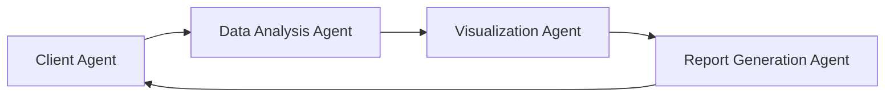
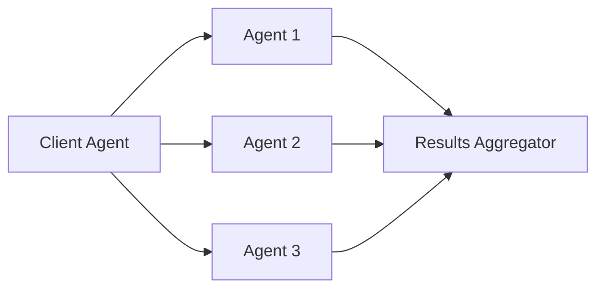
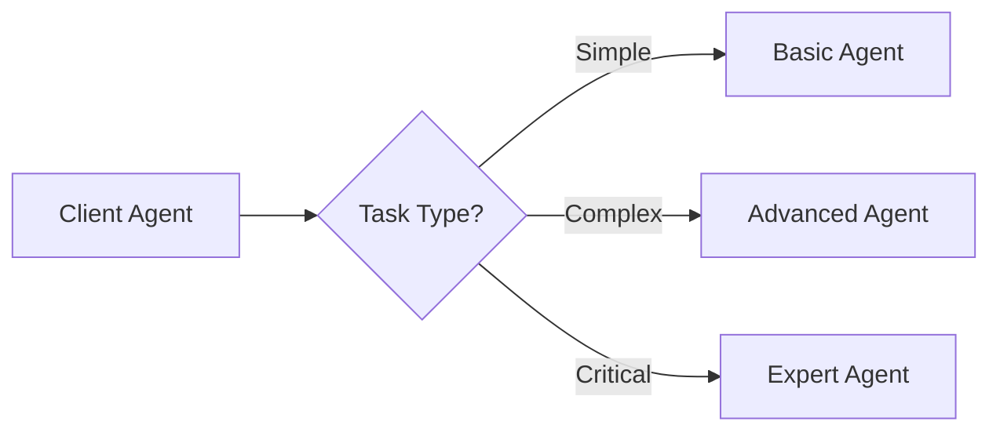

# Sample A2A Agents

This section showcases real-world examples of A2A-compatible agents that demonstrate various capabilities and integration patterns. These samples provide practical examples of how agents can be implemented and integrated using the A2A protocol.

## 📋 Featured Agents

### 1. Data Analysis Agent
**Provider:** OpenAI  
**Categories:** Data Analysis, Research  
**Skills:** Data processing, Statistical analysis, Visualization

**Description:**  
A specialized agent for data analysis tasks, capable of processing large datasets, performing statistical analysis, and generating visualizations. This agent demonstrates how A2A can be used for complex data workflows.

**Key Features:**
- CSV/JSON data processing
- Statistical analysis and modeling
- Chart and graph generation
- Report generation
- Integration with popular data sources

**A2A Integration Example:**
```json
{
  "agent_id": "data-analysis-agent",
  "capabilities": {
    "data_processing": {
      "supported_formats": ["csv", "json", "excel"],
      "max_file_size": "100MB"
    },
    "analysis": {
      "statistical_tests": ["t-test", "anova", "correlation"],
      "visualization_types": ["bar", "line", "scatter", "heatmap"]
    }
  }
}
```

### 2. Customer Support Agent
**Provider:** Anthropic  
**Categories:** Customer Service, Communication  
**Skills:** Natural language processing, Ticket management, Escalation

**Description:**  
An intelligent customer support agent that can handle customer inquiries, manage support tickets, and escalate complex issues to human agents when necessary.

**Key Features:**
- Natural language understanding
- Multi-language support
- Ticket categorization and routing
- Knowledge base integration
- Escalation protocols

### 3. Code Review Agent
**Provider:** GitHub  
**Categories:** Development, Code Quality  
**Skills:** Code analysis, Security scanning, Best practices

**Description:**  
An automated code review agent that analyzes code quality, identifies potential issues, and suggests improvements based on best practices and security standards.

**Key Features:**
- Static code analysis
- Security vulnerability detection
- Code style enforcement
- Performance optimization suggestions
- Integration with CI/CD pipelines

### 4. Financial Analysis Agent
**Provider:** Bloomberg  
**Categories:** Finance, Analytics  
**Skills:** Market analysis, Risk assessment, Portfolio optimization

**Description:**  
A financial analysis agent that provides market insights, risk assessments, and portfolio optimization recommendations based on real-time market data.

**Key Features:**
- Real-time market data analysis
- Risk assessment models
- Portfolio optimization algorithms
- Regulatory compliance checking
- Financial reporting

## 🔧 Integration Patterns

### Pattern 1: Sequential Task Delegation


**Use Case:** Multi-step data processing workflow where each agent specializes in a specific task.

### Pattern 2: Parallel Processing


**Use Case:** Processing multiple independent tasks simultaneously for improved performance.

### Pattern 3: Conditional Routing


**Use Case:** Routing tasks to different agents based on complexity or requirements.

## 📊 Agent Capabilities Matrix

| Agent Type | Data Processing | Communication | Analysis | Integration | Security |
|------------|----------------|---------------|----------|-------------|----------|
| Data Analysis | ⭐⭐⭐⭐⭐ | ⭐⭐⭐ | ⭐⭐⭐⭐⭐ | ⭐⭐⭐⭐ | ⭐⭐⭐ |
| Customer Support | ⭐⭐ | ⭐⭐⭐⭐⭐ | ⭐⭐⭐ | ⭐⭐⭐⭐ | ⭐⭐⭐⭐ |
| Code Review | ⭐⭐⭐⭐ | ⭐⭐ | ⭐⭐⭐⭐⭐ | ⭐⭐⭐⭐⭐ | ⭐⭐⭐⭐⭐ |
| Financial Analysis | ⭐⭐⭐⭐⭐ | ⭐⭐⭐ | ⭐⭐⭐⭐⭐ | ⭐⭐⭐ | ⭐⭐⭐⭐⭐ |

## 🚀 Best Practices

### Agent Design
1. **Single Responsibility** - Each agent should have a clear, focused purpose
2. **Stateless Design** - Avoid maintaining state between requests when possible
3. **Error Handling** - Implement robust error handling and recovery mechanisms
4. **Documentation** - Provide comprehensive documentation for all capabilities

### Integration
1. **Standard Interfaces** - Use consistent API patterns across all agents
2. **Versioning** - Implement proper versioning for agent capabilities
3. **Testing** - Thoroughly test agent interactions and edge cases
4. **Monitoring** - Implement comprehensive logging and monitoring

### Security
1. **Authentication** - Use secure authentication mechanisms
2. **Authorization** - Implement fine-grained access control
3. **Data Protection** - Ensure sensitive data is properly protected
4. **Audit Logging** - Maintain detailed audit trails

## 📝 Creating Your Own Agent

### Step 1: Define Capabilities
```json
{
  "agent_name": "My Custom Agent",
  "version": "1.0.0",
  "capabilities": {
    "primary_function": "Description of main capability",
    "supported_inputs": ["text", "json", "file"],
    "supported_outputs": ["text", "json", "file"],
    "authentication": ["api_key", "oauth2"]
  }
}
```

### Step 2: Implement A2A Interface
```python
from a2a import Agent, Task, Response

class MyCustomAgent(Agent):
    async def process_task(self, task: Task) -> Response:
        # Implement your agent logic here
        result = await self.process_input(task.input)
        return Response(content=result, status="completed")
```

### Step 3: Test and Validate
- Test with A2A compliance tools
- Validate against the official A2A specification
- Perform integration testing with other agents

### Step 4: Submit to Catalog
- Create comprehensive documentation
- Provide usage examples
- Submit through the A2A Catalog platform

## 🔗 Resources

- [A2A Protocol Specification](https://google-a2a.github.io/A2A/latest/)
- [Agent Development Guide](../guides/agent-development.md)
- [Integration Examples](../examples/integration-patterns.md)
- [Testing Framework](../guides/testing.md)

---

*These sample agents demonstrate the versatility and power of the A2A protocol. Use them as inspiration for building your own agents and contributing to the ecosystem.* 