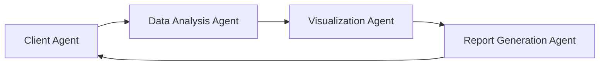
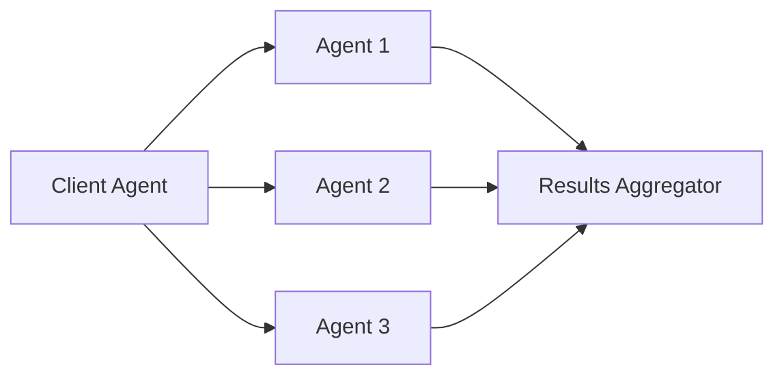
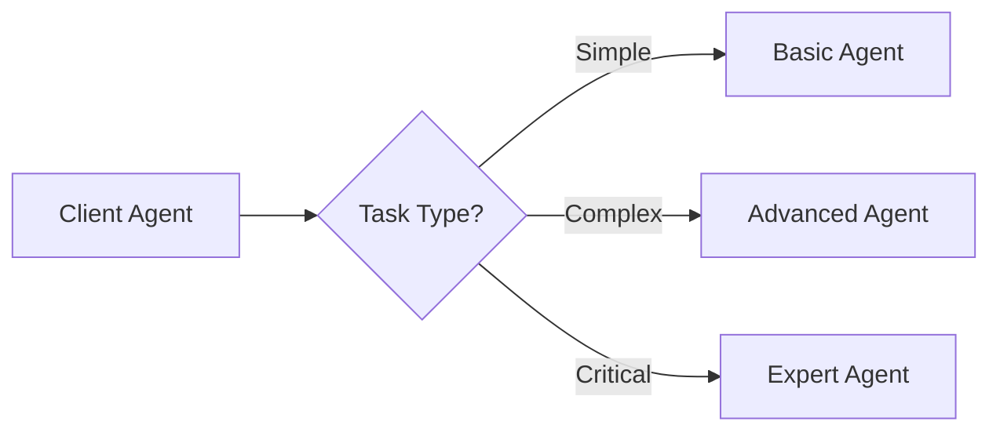

# A2A Integration Patterns & Code Examples

This section provides comprehensive code examples and integration patterns for working with A2A agents. These examples demonstrate real-world usage scenarios and best practices.

## 🚀 Quick Integration Examples

### JavaScript/Node.js Integration

#### Basic Agent Integration
```javascript
// Example: Integrating a data analysis agent
const response = await fetch('https://api.a2acatalog.com/agents/data-analysis', {
  method: 'POST',
  headers: {
    'Authorization': 'Bearer YOUR_API_KEY',
    'Content-Type': 'application/json'
  },
  body: JSON.stringify({
    task: 'analyze_dataset',
    data: yourDataset,
    options: {
      analysis_type: 'statistical',
      output_format: 'json'
    }
  })
});

const result = await response.json();
console.log('Analysis result:', result);
```

#### Webhook Integration
```javascript
// Set up webhook endpoint
app.post('/agent-webhook', (req, res) => {
  const { agent_id, task_id, result } = req.body;
  
  // Process the result
  console.log(`Agent ${agent_id} completed task ${task_id}`);
  console.log('Result:', result);
  
  res.status(200).send('OK');
});
```

#### Rate Limiting Implementation
```javascript
// Implement rate limiting
const rateLimiter = new RateLimiter({
  maxRequests: 100,
  perMinute: 1
});

async function callAgent(agentId, data) {
  await rateLimiter.wait();
  return await agentClient.processTask(agentId, data);
}
```

#### Secure API Key Management
```javascript
// Store API keys securely
const API_KEY = process.env.A2A_API_KEY;

// Use environment variables
// .env file:
// A2A_API_KEY=your_api_key_here
```

### Python Integration

#### Direct API Integration
```python
import requests

def integrate_agent(agent_id, task_data):
    url = f"https://api.a2acatalog.com/agents/{agent_id}"
    
    response = requests.post(url, json=task_data, headers={
        'Authorization': f'Bearer {API_KEY}',
        'Content-Type': 'application/json'
    })
    
    return response.json()
```

#### SDK Integration
```python
from a2a_catalog import AgentClient

client = AgentClient(api_key='YOUR_API_KEY')
agent = client.get_agent('data-analysis-agent')

result = agent.process_task({
    'type': 'analyze_data',
    'data': dataset,
    'options': {'format': 'json'}
})
```

#### Error Handling
```python
try:
    result = agent.process_task(task_data)
except AgentError as e:
    logger.error(f"Agent error: {e}")
    # Handle error appropriately
except NetworkError as e:
    logger.error(f"Network error: {e}")
    # Implement retry logic
```

#### Testing Integration
```python
import pytest
from a2a_catalog import AgentClient

def test_agent_integration():
    client = AgentClient(api_key='test_key')
    agent = client.get_agent('test-agent')
    
    result = agent.process_task({
        'type': 'test_task',
        'input': 'test_data'
    })
    
    assert result['status'] == 'completed'
    assert 'output' in result
```

## 🔧 Agent Implementation Examples

### Creating a Custom Agent

#### Step 1: Define Agent Capabilities
```json
{
  "agent_name": "My Custom Agent",
  "version": "1.0.0",
  "capabilities": {
    "primary_function": "Description of main capability",
    "supported_inputs": ["text", "json", "file"],
    "supported_outputs": ["text", "json", "file"],
    "authentication": ["api_key", "oauth2"]
  }
}
```

#### Step 2: Implement A2A Interface
```python
from a2a import Agent, Task, Response

class MyCustomAgent(Agent):
    async def process_task(self, task: Task) -> Response:
        # Implement your agent logic here
        result = await self.process_input(task.input)
        return Response(content=result, status="completed")
```

#### Step 3: Agent Configuration
```json
{
  "agent_id": "data-analysis-agent",
  "capabilities": {
    "data_processing": {
      "supported_formats": ["csv", "json", "excel"],
      "max_file_size": "100MB"
    },
    "analysis": {
      "statistical_tests": ["t-test", "anova", "correlation"],
      "visualization_types": ["bar", "line", "scatter", "heatmap"]
    }
  }
}
```

## 🔄 Integration Patterns

### Pattern 1: Sequential Task Delegation


**Implementation:**
```python
async def sequential_workflow(data):
    # Step 1: Data Analysis
    analysis_result = await data_analysis_agent.process(data)
    
    # Step 2: Visualization
    viz_result = await visualization_agent.process(analysis_result)
    
    # Step 3: Report Generation
    report = await report_agent.process(viz_result)
    
    return report
```

### Pattern 2: Parallel Processing


**Implementation:**
```python
import asyncio

async def parallel_workflow(data):
    # Process multiple tasks in parallel
    tasks = [
        agent1.process(data),
        agent2.process(data),
        agent3.process(data)
    ]
    
    results = await asyncio.gather(*tasks)
    
    # Aggregate results
    return aggregate_results(results)
```

### Pattern 3: Conditional Routing


**Implementation:**
```python
async def conditional_routing(task):
    if task.complexity == 'simple':
        return await basic_agent.process(task)
    elif task.complexity == 'complex':
        return await advanced_agent.process(task)
    elif task.complexity == 'critical':
        return await expert_agent.process(task)
    else:
        raise ValueError("Unknown task complexity")
```

## 🛠️ Development Setup Examples

### Local Development Environment
```bash
# Clone the Repository
git clone https://github.com/your-org/a2a-catalog.git
cd a2a-catalog

# Install Dependencies
npm install
# or
pip install -r requirements.txt

# Set Up Environment
cp .env.example .env
# Edit .env with your configuration

# Start Development Server
npm run dev
# or
python app.py
```

### Environment Configuration
```bash
# .env file example
A2A_API_KEY=your_api_key_here
A2A_BASE_URL=https://api.a2acatalog.com
A2A_WEBHOOK_URL=https://your-domain.com/webhook
NODE_ENV=development
```

## 🔒 Security Examples

### Authentication Implementation
```python
import jwt
from datetime import datetime, timedelta

def create_auth_token(user_id, api_key):
    payload = {
        'user_id': user_id,
        'api_key': api_key,
        'exp': datetime.utcnow() + timedelta(hours=24)
    }
    return jwt.encode(payload, 'your-secret-key', algorithm='HS256')

def verify_auth_token(token):
    try:
        payload = jwt.decode(token, 'your-secret-key', algorithms=['HS256'])
        return payload
    except jwt.ExpiredSignatureError:
        raise Exception("Token expired")
    except jwt.InvalidTokenError:
        raise Exception("Invalid token")
```

### Request Signing
```python
import hmac
import hashlib
import time

def sign_request(api_key, timestamp, body):
    message = f"{timestamp}{body}"
    signature = hmac.new(
        api_key.encode('utf-8'),
        message.encode('utf-8'),
        hashlib.sha256
    ).hexdigest()
    return signature

def make_signed_request(url, api_key, data):
    timestamp = str(int(time.time()))
    body = json.dumps(data)
    signature = sign_request(api_key, timestamp, body)
    
    headers = {
        'Authorization': f'Bearer {api_key}',
        'X-Timestamp': timestamp,
        'X-Signature': signature,
        'Content-Type': 'application/json'
    }
    
    return requests.post(url, json=data, headers=headers)
```

## 📊 Monitoring and Logging

### Request Logging
```python
import logging
import time

logger = logging.getLogger(__name__)

def log_agent_request(agent_id, request_data, response_data, duration):
    logger.info({
        'agent_id': agent_id,
        'request_size': len(str(request_data)),
        'response_size': len(str(response_data)),
        'duration_ms': duration * 1000,
        'timestamp': time.time()
    })
```

### Performance Monitoring
```javascript
class AgentMonitor {
  constructor() {
    this.metrics = {
      requests: 0,
      errors: 0,
      avgResponseTime: 0
    };
  }

  trackRequest(agentId, startTime) {
    this.metrics.requests++;
    
    return (response, error) => {
      const duration = Date.now() - startTime;
      
      if (error) {
        this.metrics.errors++;
      }
      
      this.metrics.avgResponseTime = 
        (this.metrics.avgResponseTime + duration) / 2;
      
      console.log(`Agent ${agentId}: ${duration}ms`);
    };
  }
}
```

## 🧪 Testing Examples

### Unit Testing
```python
import unittest
from unittest.mock import Mock, patch
from a2a_catalog import AgentClient

class TestAgentIntegration(unittest.TestCase):
    def setUp(self):
        self.client = AgentClient(api_key='test_key')
    
    @patch('requests.post')
    def test_agent_request(self, mock_post):
        # Mock successful response
        mock_response = Mock()
        mock_response.json.return_value = {
            'status': 'completed',
            'result': 'test_result'
        }
        mock_post.return_value = mock_response
        
        # Test the integration
        result = self.client.get_agent('test-agent').process_task({
            'type': 'test_task',
            'input': 'test_data'
        })
        
        self.assertEqual(result['status'], 'completed')
        self.assertEqual(result['result'], 'test_result')
```

### Integration Testing
```python
import pytest
import asyncio

@pytest.mark.asyncio
async def test_full_workflow():
    # Test complete workflow
    client = AgentClient(api_key='test_key')
    
    # Test data analysis workflow
    data = {'test': 'data'}
    
    # Step 1: Data processing
    processed = await client.get_agent('data-processor').process_task({
        'type': 'process',
        'data': data
    })
    
    # Step 2: Analysis
    analyzed = await client.get_agent('data-analyzer').process_task({
        'type': 'analyze',
        'data': processed['result']
    })
    
    # Step 3: Visualization
    visualized = await client.get_agent('visualizer').process_task({
        'type': 'visualize',
        'data': analyzed['result']
    })
    
    assert visualized['status'] == 'completed'
    assert 'visualization' in visualized['result']
```

## 📚 Complete Example: Data Analysis Pipeline

Here's a complete example of a data analysis pipeline using multiple A2A agents:

```python
import asyncio
from a2a_catalog import AgentClient
import pandas as pd

class DataAnalysisPipeline:
    def __init__(self, api_key):
        self.client = AgentClient(api_key=api_key)
    
    async def analyze_dataset(self, data_path):
        """Complete data analysis pipeline"""
        
        # Step 1: Data Loading and Cleaning
        data_agent = self.client.get_agent('data-loader')
        cleaned_data = await data_agent.process_task({
            'type': 'load_and_clean',
            'file_path': data_path,
            'options': {
                'remove_duplicates': True,
                'handle_missing': 'interpolate'
            }
        })
        
        # Step 2: Statistical Analysis
        stats_agent = self.client.get_agent('statistical-analyzer')
        analysis = await stats_agent.process_task({
            'type': 'comprehensive_analysis',
            'data': cleaned_data['result'],
            'options': {
                'tests': ['descriptive', 'correlation', 'outlier_detection'],
                'confidence_level': 0.95
            }
        })
        
        # Step 3: Visualization
        viz_agent = self.client.get_agent('visualization-generator')
        visualizations = await viz_agent.process_task({
            'type': 'create_dashboard',
            'data': analysis['result'],
            'options': {
                'charts': ['histogram', 'scatter', 'correlation_matrix'],
                'format': 'html'
            }
        })
        
        # Step 4: Report Generation
        report_agent = self.client.get_agent('report-generator')
        report = await report_agent.process_task({
            'type': 'generate_report',
            'analysis': analysis['result'],
            'visualizations': visualizations['result'],
            'options': {
                'format': 'pdf',
                'include_recommendations': True
            }
        })
        
        return {
            'cleaned_data': cleaned_data['result'],
            'analysis': analysis['result'],
            'visualizations': visualizations['result'],
            'report': report['result']
        }

# Usage example
async def main():
    pipeline = DataAnalysisPipeline('your_api_key')
    results = await pipeline.analyze_dataset('path/to/your/data.csv')
    
    print("Analysis complete!")
    print(f"Report generated: {results['report']}")

if __name__ == "__main__":
    asyncio.run(main())
```

## 🔗 Additional Resources

- [A2A Protocol Specification](https://google-a2a.github.io/A2A/latest/)
- [Agent Development Guide](../guides/agent-development.md)
- [Best Practices](../guides/best-practices.md)
- [Testing Framework](../guides/testing.md)

---

*These examples demonstrate practical integration patterns and best practices for working with A2A agents. Use them as starting points for your own implementations.* 